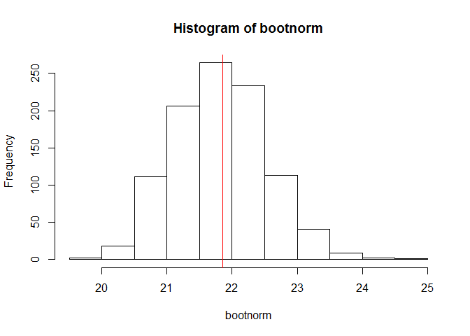

# Visualizing the Central Limit Theorem
Michael Smith  
May 29, 2016  

First, we need to establish an initial sample and discover it's mean:


```r
x <- rnorm(50, 22, 5)
xbar <- mean(x)
summary(x)
```

```
##    Min. 1st Qu.  Median    Mean 3rd Qu.    Max. 
##   12.82   18.30   20.90   21.85   24.96   35.99
```

Next we create a bootstrap sample based of the initial sample as though it was a population:


```r
nsims <- 1000
bootnorm <- numeric(nsims)
for (i in 1:nsims) {
	temp <- sample(x, 50, replace=TRUE)
	bootnorm[i] <- mean(temp)
}
summary(bootnorm)
```

```
##    Min. 1st Qu.  Median    Mean 3rd Qu.    Max. 
##   19.75   21.32   21.82   21.82   22.29   24.57
```

Now that we have our sample, we can see on a histogram that the bootstrap sample is normally distributed around the initial sample population mean in red:


```r
hist(bootnorm)
abline(v=xbar, col="red")
```

<!-- -->

Further, we can compare the standard deviation of the origianl population and the bootstrap population:


```r
sd(x)
```

```
## [1] 5.185874
```

```r
sd(bootnorm)
```

```
## [1] 0.7112368
```
