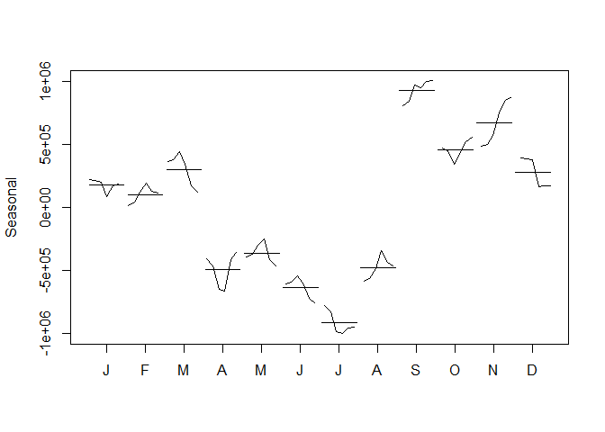

# MSmith_402_Week_10_Case_Study
Michael Smith  
July 17, 2016  


# Introduction

The purpose of this analysis is to attempt to create a forecasting model for Chulwalar exports. First we will compare the current exports with the planned exports, then examine correlated variables and from there attempt to build a model that reflects those variables using the "As Is" data. Finally, we will then put the forecast side by side with the "As Is" and "Planned" data for total exports.

### Planned vs As Is

Visually, we can see that the planned exports match fairly closely with the current "As Is" data (corr 0.9183402). Below, the "As Is" data for total exports is shown in black. The "Planned" data is overlayed in green.

<!-- -->

### As Is Decomposition

When we breakdown the "As Is" data, we can see an obvious seasonal component, with an upward linear trend in the overall data. The seasonal component appears to be yearly, with a peak sometime around September to November and a dip around June and July.

<!-- --><!-- -->

### Modeling As Is using Trend and Season


Given the seasonality and linear trend of the "As Is" data, we can begin by focusing our model through this lense. We found an adjusted R² of 0.9004392 which seems to indicate a good fit. 

We began by first creating truncated tables that stop at 2012. From this, we'll perform a test forecast for 2013 and then compare that to real to check to see if our model follows the actual data. Below, the forecasted data is in blue, with the actual "As Is" data in green.


<!-- -->


We were able to find a strong correlation (corr 0.9138049) between the forecasted 2013 data and the actual "As Is" data. Further, a linear regression revealed that with 95% confidence we are unable to say the extremes within the actual "As Is" data could not be found within the forecasted data (p = 0.2412323)

### Predicting Total "As Is" data for 2014


Because we're focused only on seasonality and trend as the two major components of the model Holt-Winters seasonal method represents the best approach to forecasting the 2014 data. When we compare the AIC of the additive and multiplicative variants of the method, we found that the additive method results in a lower AIC (2124.8562044) compared to the multiplicative (2128.3027235).

This gives us a plot using the Holt-Winters Additive Forecast as follows:

<!-- -->

From the forecase we produced a set of predicted number of exports by month for 2014:


```
##          Jan     Feb     Mar     Apr     May     Jun     Jul     Aug
## 2014 4141204 4147309 4318537 3642744 3704865 3488859 3336738 3750478
##          Sep     Oct     Nov     Dec
## 2014 5137771 4772337 4988809 4629097
```
