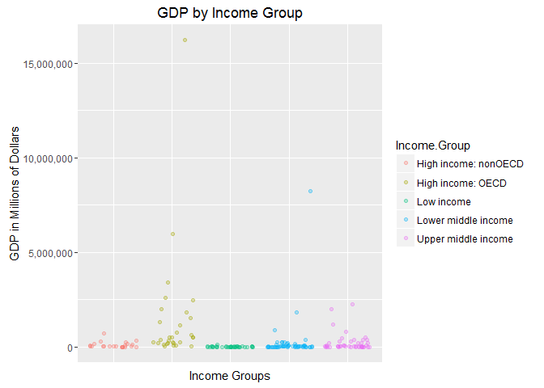

# 6306-402 Unit 6 Case Study
Michael Smith  
June 19, 2016  

## Introduction

The purpose of this case study is to identify global GDP rankings and compare them to defined income groups. By the end of this study, it should be possible to better visualize a country's GDP in relation to other countries and its own income bracket. The data that is being used in this study has been/will be downloaded from an online repository at https://d396qusza40orc.cloudfront.net/.


## Questions

1. Match the data based on the country shortcode. How many of the IDs match?


After the merge, we see that only 189 countries were successfully matched. This is because the countries data file did not contain information on South Sudan, only the Republic of Sudan.

2. Sort the data frame in ascending order by GDP rank (so United States is last). What is the 13th country in the resulting data frame?


Once we reverse order the countries by rank, we find that the thirteenth country is St. Kitts and Nevis.

3. What are the average GDP rankings for the "High income: OECD" and "High income: nonOECD" groups?


Once we separate the ranked countries into High Income OECD and nonOECD we found the average rankings to be 32.9666667 for High Income: OECD and 91.9130435 for High Income: nonOECD.

4. Plot the GDP for all of the countries. Use ggplot2 to color your plot by Income Group.

To most effectively present this data, a jitter plot of GDP by Income Group with an alpha transparency for overlapping values was chosen. This lets us easily identify strange outliers with extremely high GDPs as well as observe the clustering of GDP within each income group.

<!-- -->

Within High Income: OECD there is an extreme outlier (The United States) with quite a bit of spread among the other nations. Surprisingly, Lower Middle Income also has quite a bit of spread in their GDP range as well. However, it's easy to see that the vast majority of all nations have a GDP less than 2.5 trillion.

5. Cut the GDP ranking into 5 separate quantile groups. Make a table versus Income.Group. How many countries are Lower middle income but among the 38 nations with the highest GDP?


```
##                       
##                         1  2  3  4  5
##   High income: nonOECD  4  5  8  4  2
##   High income: OECD    18 10  1  1  0
##   Low income            0  1  9 16 11
##   Lower middle income   5 13 12  8 16
##   Upper middle income  11  9  8  8  9
```

Once we grouped countries by Quantile vs Income Group, we found that there are 5 countries that are in the top 38 highest GDPs but are within the Lower Middle Income group.

## Conclusion

The rankings of GDP seem to be dominated by an elite few. Further, countries engaged in a cooperative effort for economic development seem to have a consistent higher ranking than non-cooperative economies. That said, the vast majority of national GDPs appear to be clustered together below 2.5 Trillion dollars per year, meaning that once you get blow a certain point, the variance between Income Groups and within Income Groups doesn't appear to be that high. But that will require additional analysis and testing to prove conclusive.
