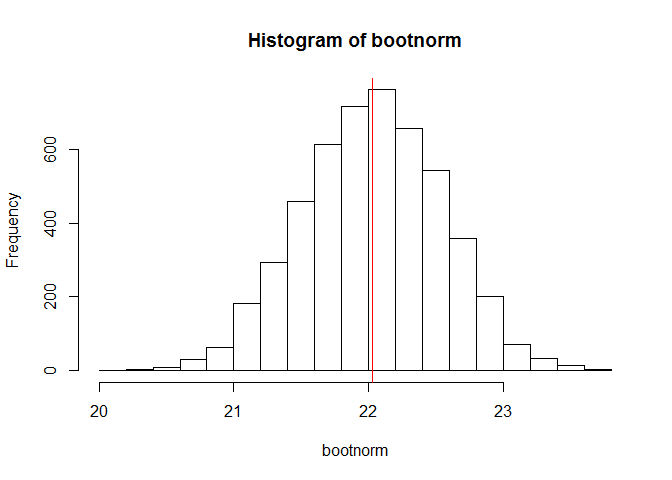
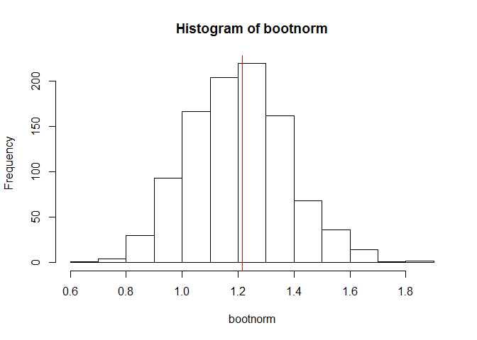
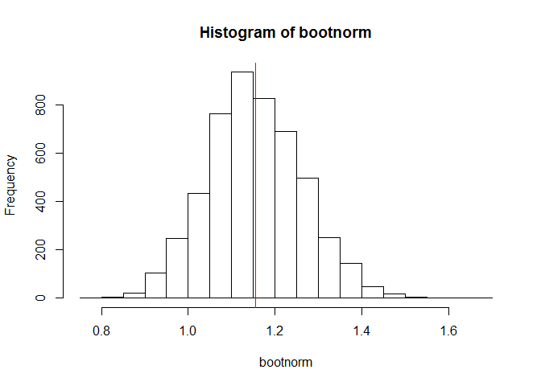

# Visualizing the Central Limit Theorem
Michael Smith  
May 29, 2016  

First, we need to establish an initial sample and discover it's mean:


```r
x <- rnorm(50, 22, 5)
xbar <- mean(x)
summary(x)
```

```
##    Min. 1st Qu.  Median    Mean 3rd Qu.    Max. 
##   13.59   19.10   22.29   22.27   25.52   29.32
```

Next we create a bootstrap sample based of the initial sample as though it was a population:


```r
nsims <- 1000
bootnorm <- numeric(nsims)
for (i in 1:nsims) {
	temp <- sample(x, 50, replace=TRUE)
	bootnorm[i] <- mean(temp)
}
summary(bootnorm)
```

```
##    Min. 1st Qu.  Median    Mean 3rd Qu.    Max. 
##   20.48   21.87   22.31   22.29   22.69   24.01
```

Now that we have our sample, we can see on a histogram that the bootstrap sample is normally distributed around the initial sample population mean in red:


```r
hist(bootnorm)
abline(v=xbar, col="red")
```

<!-- -->

As we increase the number of bootstrap iterations taken, the histogram will become more and more normally distributed. We can also compare it to increased sample sizes of the original population.


```r
x <- rnorm(100, 22, 5)
xbar <- mean(x)
summary(x)
```

```
##    Min. 1st Qu.  Median    Mean 3rd Qu.    Max. 
##   8.944  18.970  22.410  22.030  25.310  32.040
```

```r
nsims <- 5000
bootnorm <- numeric(nsims)
for (i in 1:nsims) {
	temp <- sample(x, 100, replace=TRUE)
	bootnorm[i] <- mean(temp)
}
summary(bootnorm)
```

```
##    Min. 1st Qu.  Median    Mean 3rd Qu.    Max. 
##   20.12   21.68   22.03   22.03   22.39   23.77
```

```r
hist(bootnorm)
abline(v=xbar, col="red")
```

<!-- -->

This effect can also be seen on samples with exponential distributions:


```r
x <- rexp(50)
xbar <- mean(x)
summary(x)
```

```
##    Min. 1st Qu.  Median    Mean 3rd Qu.    Max. 
## 0.01744 0.36860 0.97790 1.21500 1.76100 7.82900
```

```r
nsims <- 1000
bootnorm <- numeric(nsims)
for (i in 1:nsims) {
	temp <- sample(x, 50, replace=TRUE)
	bootnorm[i] <- mean(temp)
}
summary(bootnorm)
```

```
##    Min. 1st Qu.  Median    Mean 3rd Qu.    Max. 
##   0.688   1.081   1.200   1.202   1.314   1.861
```

```r
hist(bootnorm)
abline(v=xbar, col="red")
```

<!-- -->

And of course, larger sample sizes within exponential distributions:


```r
x <- rexp(100)
xbar <- mean(x)
summary(x)
```

```
##    Min. 1st Qu.  Median    Mean 3rd Qu.    Max. 
## 0.02193 0.31290 0.84540 1.15600 1.67900 5.63500
```

```r
nsims <- 5000
bootnorm <- numeric(nsims)
for (i in 1:nsims) {
	temp <- sample(x, 100, replace=TRUE)
	bootnorm[i] <- mean(temp)
}
summary(bootnorm)
```

```
##    Min. 1st Qu.  Median    Mean 3rd Qu.    Max. 
##  0.7766  1.0790  1.1490  1.1540  1.2270  1.6590
```

```r
hist(bootnorm)
abline(v=xbar, col="red")
```

<!-- -->
