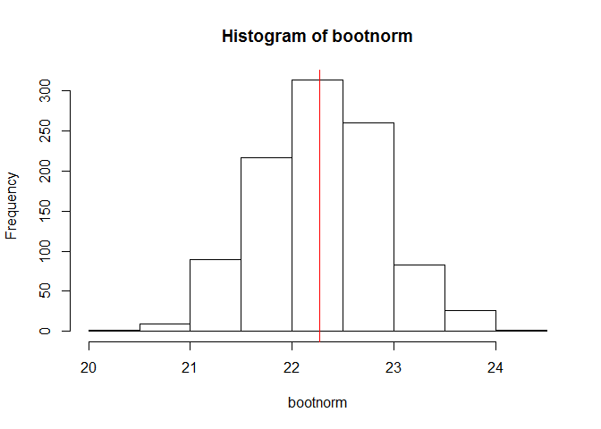

# Visualizing the Central Limit Theorem
Michael Smith  
May 29, 2016  

First, we need to establish an initial sample and discover it's mean:


```r
x <- rnorm(50, 22, 5)
xbar <- mean(x)
summary(x)
```

```
##    Min. 1st Qu.  Median    Mean 3rd Qu.    Max. 
##   12.84   19.16   21.97   22.41   25.54   34.58
```

Next we create a bootstrap sample based of the initial sample as though it was a population:


```r
nsims <- 1000
bootnorm <- numeric(nsims)
for (i in 1:nsims) {
	temp <- sample(x, 50, replace=TRUE)
	bootnorm[i] <- mean(temp)
}
summary(bootnorm)
```

```
##    Min. 1st Qu.  Median    Mean 3rd Qu.    Max. 
##   20.49   21.96   22.41   22.39   22.85   24.28
```

Now that we have our sample, we can see on a histogram that the bootstrap sample is normally distributed around the initial sample population mean in red:


```r
hist(bootnorm)
abline(v=xbar, col="red")
```

<!-- -->

As we increase the number of bootstrap iterations taken, the histogram will become more and more normally distributed. Further, we can compare the standard deviation of the origianl population and the bootstrap population to see a more direct comparison in the distribution of the values:


```r
sd(x)
```

```
## [1] 4.504643
```

```r
sd(bootnorm)
```

```
## [1] 0.6526205
```

The closer the SD is to zero, the closer the data is to being normally distributed.
